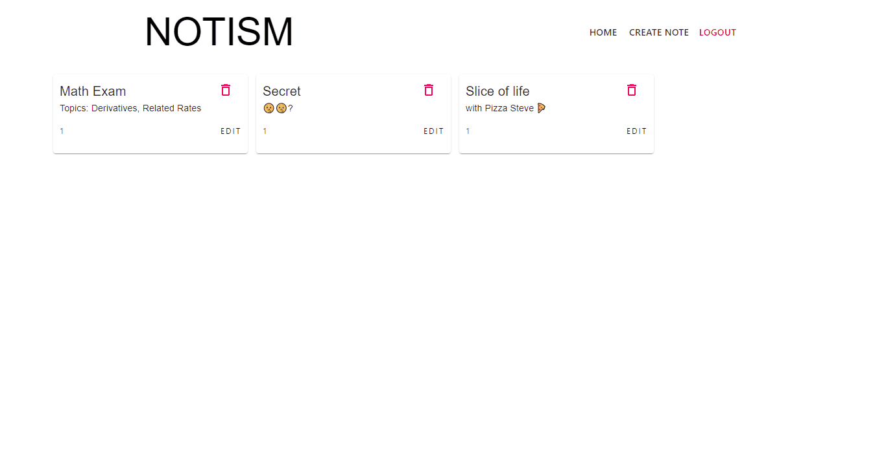

## notism

<p align="center">
  
  
  
</p>




##### Demo: https://notism.herokuapp.com/

###### Create and store your notes !

---

## Description

Full Stack Web Application for creating, storing, updating, and deleting notes in your own account. 

## Techstack used:
> - MongoDB
> - Express
> - React
> - Node.js
> - Material-UI 
> - bcrypt & JWT

## Getting Started

```bash
# Clone the repository
git clone https://github.com/zenthiccc/notism.git
```
```bash
# Install dependencies for server
npm install

# Install dependencies for client
cd client/ && npm install
```
```bash
# Connect MongoDB by adding MongoDB URL in `.env` file
```
```bash

# Run the client & server with concurrently
npm run dev

# Run the server only
npm run server

# Run the client only
npm run client

```
